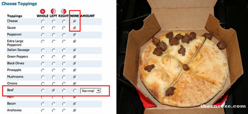
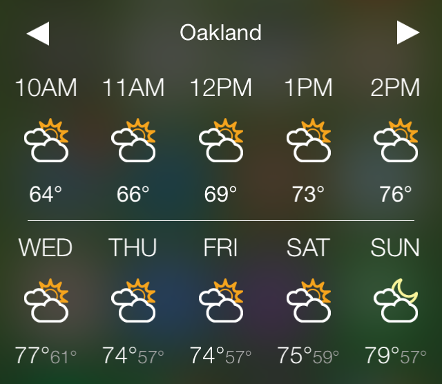
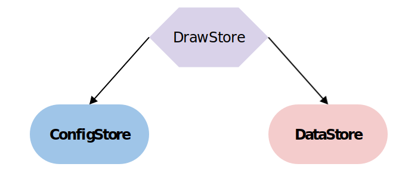
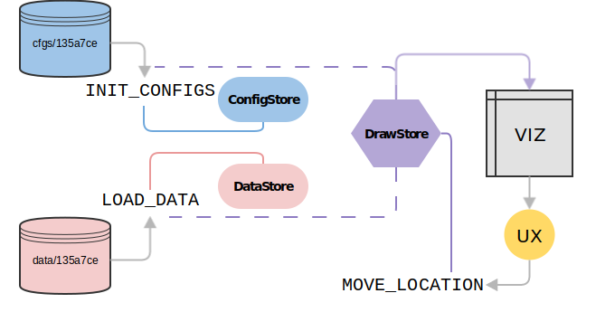
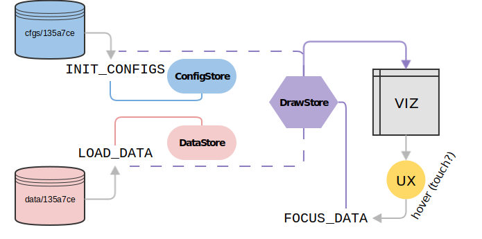
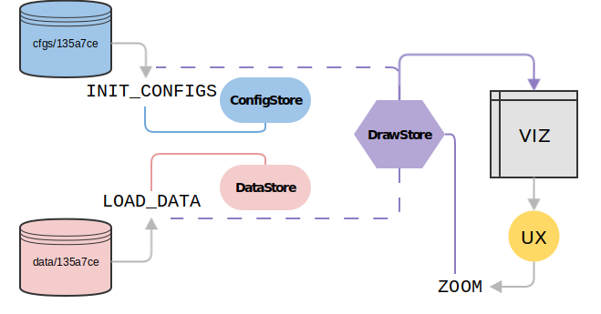
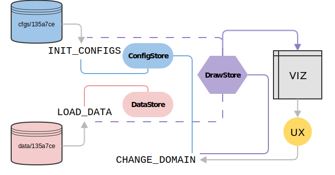

# FLUX <!-- .element: class="photo-overlay huge white-shadow" -->
## for data visualization <!-- .element: class="photo-overlay white-shadow" -->
### (a preliminary manifesto) <!-- .element: class="photo-overlay white-shadow" -->
<!-- .slide: data-background="images/aurora-borealis.jpg" -->

<a class="image-source white-link" target="_blank" href="https://www.flickr.com/photos/58122391@N03/5342588503/in/faves-134718242@N08/">(image source)</a>

Note:
This isn't the slide you're looking for. Just the title ;)


# Jana Beck
## Software Engineer, Tidepool
### <small>GitHub:</small> [@jebeck](https://github.com/jebeck) <small>(also Freenode IRC, Gitter, Slack, etc.)</small>
### <small>Twitter:</small> [@iPancreas](https://twitter.com/iPancreas)
<!-- .slide: data-background="images/lancets.jpg" -->

Note:
Hi. I'm an engineer at Tidepool. We're a not-for-profit, open-source effort to reduce the burden of type 1 diabetes through data technology. I work a lot on our data services, both data ingestion and (our topic today) data visualization.

I'm jebeck on GitHub and in most other places, including the Reactiflux Slack. Feel free to reach out after this talk - I really hope it's going to be a conversation starter.


# slides
## [janabeck.com/flux-for-dataviz](http://janabeck.com/flux-for-dataviz)
<!-- .slide: data-background="images/lancets.jpg" -->

Note:
And here's a link to where these slides are hosted on the web, in case you want to follow along and the WiFi is cooperating.


# WARNING <!-- .element: class="photo-overlay huge white-shadow" -->
<!-- .slide: data-background="images/construction.jpg" -->

<a class="image-source white-link" target="_blank" href="https://www.flickr.com/photos/shenamt/6906784503/in/faves-134718242@N08/">(image source)</a>

Note:
Before we dive in, I want to be explicit about the fact that my goal here is to talk through some of the challenges and problems I've been thinking through as I think about what the next version of our data visualization library at Tidepool might look like. What that means is that everything I'm about to talk to you about is quite preliminary. We're going to be talking about thoughts and ideas and experiments that are still very much under construction and unproven.

Even though these ideas *are* unproven, I hope that seeing what it looks like to think about implementing the Flux architecture for a large, complex, pre-existing real-world application will be useful.


# tideline <!-- .element: class="photo-overlay-dark huge white-shadow" -->
<!-- .slide: data-background="images/tideline.png" -->

Note:
Our data visualization library at Tidepool is called tideline. We use it to create all of the data displays in our main web app blip. I'm going to walk you through some of its functionality briefly, just so you have an idea of the size and scope of the task we're talking about.


<!-- .slide: data-background-video-loop data-background-video="video/tideline.webm" -->

Note:
Tideline started with this one-day view - a horizontal scrolling timeline showing twenty-four hours at a time, with some summary statistics that update as you scroll along the timeline. The two-week view has also been in the app since the very beginning; it's a reverse-chronological vertical scrolling summary of a subset of the data. The app has gotten larger and larger since, with a "trends" view showing days of data layered into a summary and a simple insulin pump settings view. We're about to start prototyping our next major addition to the views - a calendar-based dashboard summary view. From any of the summary views, double-clicking on a piece of data that's of particular interest will jump you back to the daily view for the day when that event occurred.

The different data views here crucially *share* state - in particular the date navigation is preserved - or in some cases translated - across views. Some of the components - for example the statistics "widgets" at the bottom that update on scroll - are also common to more than one view. For these reasons, I've started thinking of this project as one "meta" data visualization with a variety of surface manifestations, rather than as a collection of separate visualizations. And what I'm going to talk about today is the current progress of my thinking with regards to managing the state of that "meta" visualization using the Flux architecture.


## (intro) <!-- .element: class="photo-overlay white-shadow" -->
# sandwiches <!-- .element: class="photo-overlay big white-shadow" -->
<!-- .slide: data-background="images/pb&j.jpg" -->

<a class="image-source white-link" target="_blank" href="https://www.flickr.com/photos/edwardconde/8536615155/in/faves-134718242@N08/">(image source)</a>

Note:
But first, let's talk about sandwiches. Bear with me for this little metaphorical aside. What we have here is the makings of a peanut butter and jelly sandwich. A classic.


# the Elvis <!-- .element: class="photo-overlay big white-shadow" -->
<!-- .slide: data-background="images/elvis.jpg" -->

<a class="image-source white-link" target="_blank" href="https://www.flickr.com/photos/davidberkowitz/6230975487/in/faves-134718242@N08/">(image source)</a>

Note:
Now this? This is another type of peanut butter sandwich - an Elvis. It's peanut butter, grilled bananas, and bacon, toasted. It is, in my opinion, the world's greatest peanut butter-based sandwich.


## how to fry <!-- .element: class="photo-overlay white-shadow" -->
# bacon <!-- .element: class="photo-overlay big white-shadow" -->
<!-- .slide: data-background="images/bacon.jpg" -->

<a class="image-source white-link" target="_blank" href="https://www.flickr.com/photos/cyclonebill/2222309331/in/faves-134718242@N08/">(image source)</a>

Note:
As a diner in a restaurant, if you want an Elvis instead of a PB & J, do you have to include instructions for how to fry the bacon in your order? Of course not. We don't order things by specifiying the procedures necessary to make them. We have better interfaces for that.


## none pizza with left beef



Note:
We have interfaces *so good*, in fact, that you can order a "none pizza with left beef" and get your order filled successfully, without having to explain any procedure at all. Your order is just a description - or you might say a declaration - of what you want.

So, you're probably asking, how is this relevant to the problem at hand, which is managing the meta-state of a complex set of data visualizations? Well, to put it a little too simply, the strategy I'm about to introduce to you is a strategy that attempts to make - on both the developer's and (at least potentially) on the user's side of things - the experience of configuring a complex interactive data visualization more like the "none pizza with left beef" experience - exactly what you want, defined through a simple but powerful interface, leaving implementation details, including procedural details, to be defined elsewhere.


# the problem <!-- .element: class="photo-overlay huge white-shadow" -->
<!-- .slide: data-background="images/disaster.gif" -->

Note:
So now let's finally really dig in, and let's start first by talking about what the problem really is. I'm going to do this with a tiny example that includes a little introduction to D3 along the way. Then I'll show you how the problem manifests in tideline today.


Note:
D3 is the JavaScript library that anchors the most commonly used toolset for interactive data visualization on the web. It stands for "Data-Driven Documents." We'll talk about some things that are specific to D3 in this section because I believe they provide a good illustration. But a lot of what I'll talk about applies equally to any client-side application with a significantly complex UI.


# what's complex? <!-- .element: class="photo-overlay-bright huge white-shadow" -->
<!-- .slide: data-background="images/complexity.jpg" -->

<a class="image-source white-link" target="_blank" href="https://www.flickr.com/photos/dominik99/384027019/in/faves-134718242@N08/">(image source)</a>

Note:
What do I mean by significantly complex? Well, the thing that leapt out at me when I was first learning about React and Flux by watching some of the videos from the Facebook team was the story of the zombie spurious unread message counter bug, always rising again from the dead, and the key point that I got out of this example was that what made debugging the situation so impossible in the pre-Flux days was the fact that many different places in the Facebook UI both displayed and had the power to manipulate the unread message count. So I've really latched onto this as my threshold for when a project or application is getting complex enough to think about employing the Flux pattern: if the same information is being displayed and potentially changed in mutltiple places in the UI, *that's* my definition of complex.


<!-- .slide: data-background-video-loop data-background-video="video/stats-widget.webm" -->

Note:
We've already seen this in tideline, with the statistics "widgets" at the bottom of two of the views that update as the user navigates along the timeline. The same data is displayed in the timeline and driving the summary statistics displayed in the widgets.


# [<small>let's make</small> a bar chart](http://bost.ocks.org/mike/bar/)

Note:
So as a tiny intro to the ideas of D3 that are relevant to the the topic at hand I'm going to cherry-pick a bit from one of the fabulous intro articles by Mike Bostock, D3's primary author. This article - "Let's Make a Bar Chart" - walks through how to create a simple data visualization - a bar chart.


input:
```JavaScript
var data = [4, 8, 15, 16, 23, 42];
```

output:
<div class="chart">
  <div style="width: 80px;">4</div>
  <div style="width: 160px;">8</div>
  <div style="width: 300px;">15</div>
  <div style="width: 320px;">16</div>
  <div style="width: 460px;">23</div>
  <div style="width: 840px;">42</div>
</div>

Note:
The problem is how to turn a small array of data into a bar chart for easy visual comparison. How could we do that?


## <small>(the straw man)</small> hard code it?

```HTML
<div id="chart">
  <div style="width: 40px;">4</div>
  <div style="width: 80px;">8</div>
  <div style="width: 150px;">15</div>
  <div style="width: 160px;">16</div>
  <div style="width: 230px;">23</div>
  <div style="width: 420px;">42</div>
</div>
```

Note:
The straw man solution is to hard code it in HTML, hand-calculating the width that each div should have in order to represent each item in the data array. This obviously doesn't scale.


## D3 to the rescue!

```JavaScript
d3.select("#chart")
	.selectAll("div")
	.data(data)
	.enter()
	.append("div")
	.style("width", function(d) { return d * 10 + "px"; })
	.text(function(d) { return d; });
```

Note:
And we can do it better with D3. Instead of manually creating divs representing each item in the data array, we can use D3 to bind the data to child divs of the main "chart" div we've set up. D3 will create the child divs if they don't exist yet (this is what the call to the `enter` method is doing). We can also assign the visual attributes that we want the divs to have with D3's `style` and `text` methods. (The former sets the width of each bar programmatically according to the value of each datum, and the latter adds the labels showing the value of each datum within each bar.)


## `\o/`

<div class="chart">
  <div style="width: 80px;">4</div>
  <div style="width: 160px;">8</div>
  <div style="width: 300px;">15</div>
  <div style="width: 320px;">16</div>
  <div style="width: 460px;">23</div>
  <div style="width: 840px;">42</div>
</div>

Note:
Hooray, we have a bar chart. (I mean, not really, because I hard-coded this to put it in my slide deck easily, but you get the idea.)


```JavaScript
.append("div")
.style("width", function(d) { return d * 10 + "px"; })
```
vs.
```JavaScript
var chart = document.getElementById('chart');
for (var i = 0; i < data.length; ++i) {
	var thisDiv = document.createElement('div');
	thisDiv.setAttribute('width', data[i] * 10 + 'px');
	chart.appendChild(thisDiv);
}
```

Note:
Now let's focus in on this bit, the calls to D3's `append` and `style` methods. These methods create the divs for each bar and assign them properly scaled widths. How would we do this in "pure" JavaScript? It's not so hard, really; it just requires a simple loop.


# ? <!-- .element: class="photo-overlay-bright huge gray-shadow" -->

Note:
So what's the difference between the two approaches?


# declarative

vs.

# procedural

Note:
The D3 version is quite a bit more declarative - we don't specify the operations in the DOM, we specify the result we want - a div added for each datum with a width 10 times the value of the datum, in pixels. The alternative - using a for loop - is by comparison quite procedural.

Now, to give you a preview of what's coming next, you're about to hear me complain about how a common pattern in D3 is too procedural. But just now I said D3 is declarative. The truth is: it's both, and I don't believe the declarative versus procedural distinction is all that black-and-white, but more of a continuum.


<!-- .slide: data-background="images/yawn.gif" -->

Note:
I also realize this is a very *very* simple example. So where does the complexity come in?


# + interactivity <!-- .element: class="photo-overlay-dark big white-shadow" -->
<!-- .slide: data-background="images/sprinkles.gif" -->

Note:
In my experience, it's the addition of interactivity that really adds a lot of complexity. I might even say that interactivity is a complexity multiplier.


## D3 tooltips
```JavaScript
d3.select("#chart")
	.selectAll("div")
	.data(data)
	.enter()
	.append("div")
	.style("width", function(d) { return d * 10 + "px"; })
	.on('mouseover', function(d) {
		d3.select(this).append("div.tooltip")
		... // position and style the tooltip div
	})
	.on('mouseout', function(d) {
		// remove the tooltip on mouseout
		d3.select(this).select('div.tooltip').remove();
	});
```

Note:
So bear with me on this tiny bar chart example for a bit longer, so that we can consider what happens when we add a little interactivity even in such a simple example. What if we want the value of the datum corresponding to each bar to appear in a tooltip instead of cluttering up the bar itself with a label? What we have in the code here is the most commonly recommended pattern in D3 for adding tooltips to elements of a visualization - by binding listener functions to the 'mouseover' and 'mouseout' events. Here the 'mouseover' listener would insert the tooltip into the DOM, and the 'mouseout' would remove it.


["Integrating D3.js visualizations in a React app"](http://nicolashery.com/integrating-d3js-visualizations-in-a-react-app/) - Nicolas Hery


Note:
So here I have to pause and give a big hat tip to Nico Hery, a former colleague of mine, who was the first to point out this issue to me. The issue is that effecting DOM manipulation through the listener functions bound to the 'mouseover' and 'mouseout' events is veering back into procedural territory. D3 is still giving us some nice syntactic sugar; we don't have to use any of the browser's DOM manipulation functions to make the tooltip, but we are manipulating the DOM more-or-less directly in response to an event.


(React dev encountering DOM manipulation in the wild)

Note:
Even worse, the state of the visualization with respect to the user's interactions is completely hidden, encapsulated tightly within the D3 code and not exposed in a developer-friendly way (for testing, for design iteration, etc.)


["Integrating D3.js visualizations in a React app"](http://nicolashery.com/integrating-d3js-visualizations-in-a-react-app/) - Nicolas Hery


Note:
So back to my hat tip.

The blog post of Nico's linked here is where he discusses this very problem and suggests the alternative of using the D3 event listeners not to *draw* the tooltips through DOM manipulation, but merely to add the datapoint currently being moused over to an array of focus objects, all of which will then be provided as the data to another (potentially) completely separate D3 module or even a React component instead that renders the tooltips.


## Flux tooltips
```JavaScript
d3.select("#chart")
	.selectAll("div")
	.data(data)
	.enter()
	.append("div")
	.style("width", function(d) { return d * 10 + "px"; })
	.on('mouseover', function(d) {
		vizActions.focusDatum(d);
	})
	.on('mouseout', function(d) {
		vizActions.unfocusDatum(d);
	});
```

Note:
The idea that I'm presenting today is basically nothing more than a further logical extension of Nico's idea - I'm advocating managing all state in a complex data visualization with the Flux architecture of one-way data flow. That means making *all* aspects of the state of a visualization explicit, with nothing buried deep inside the D3 modules used for rendering. Instead of binding `mouseover` and `mouseout` events to listener functions that manipulate the DOM, I'm advocating binding them to Flux action creators.

The best thing about this solution is that it's totally agnostic about *how* you're going to display the focused data. So you might even be able to do something like: if you're in a browser on a laptop or desktop, you render a tooltip, but if you're on a touchscreen tablet, you render the information in a sidebar because touch-based tooltips are kind of odd and finicky on a touchscreen.


# [<small>towards</small> reusable charts](http://bost.ocks.org/mike/chart/)

Note:
So the common tooltip creation pattern is one D3 pattern that strikes me as too procedural. Unfortunately it's not the only one.

In another article, Mike Bostock builds an argument for his recommendation of how to write resuable visualization code with D3.


## &ldquo;implement **charts**
## as closures
## with getter-setter methods"

Note:
It all boils down to this, a direct quotation: "implement charts as closures with getter-setter methods". This is how much of D3 itself is written, and it's also a pretty familiar type of API for anyone who's ever worked with something like jQuery. So where's the problem?


```JavaScript
poolXAxis = chart.newPool()
  .id('poolXAxis', chart.poolGroup())
  .label('')
  .labelBaseline(options.labelBaseline)
  .weight(0.65)
  .gutterWeight(0.0);

// messages pool
poolMessages = chart.newPool()
  .id('poolMessages', chart.poolGroup())
  .label('')
  .labelBaseline(options.labelBaseline)
  .weight(0.5)
  .gutterWeight(0.0);

// blood glucose data pool
poolBG = chart.newPool()
  .id('poolBG', chart.poolGroup())
  .label([{
    'main': 'Blood Glucose',
    'light': ' ' + chart.options.bgUnits
  }])
  .labelBaseline(options.labelBaseline)
  .legend(['bg'])
  .weight(2)
  .gutterWeight(1.0);

// carbs and boluses data pool
poolBolus = chart.newPool()
  .id('poolBolus', chart.poolGroup())
  .label([{
    'main': 'Bolus',
    'light': ' u'
  },
  {
    'main': ' & Carbohydrates',
    'light': ' g'
  }])
  .labelBaseline(options.labelBaseline)
  .legend(['bolus', 'carbs'])
  .weight(1.5)
  .gutterWeight(1.0);

// basal data pool
poolBasal = chart.newPool()
  .id('poolBasal', chart.poolGroup())
  .label([{
    main: 'Basal Rates',
    light: ' u/hr'
  }])
  .labelBaseline(options.labelBaseline)
  .legend(['basal'])
  .index(chart.pools().indexOf(poolBasal))
  .weight(1.0)
  .gutterWeight(1.0);

// stats data pool
poolStats = chart.newPool()
  .id('poolStats', chart.poolGroup())
  .index(chart.pools().indexOf(poolStats))
  .weight(1.0)
  .gutterWeight(1.0);

chart.arrangePools();

chart.setAnnotation().setTooltip();

// add annotations
chart.annotations().addGroup(chart.svg().select('#' + poolBG.id()), 'smbg');
chart.annotations().addGroup(chart.svg().select('#' + poolBolus.id()), 'bolus');
chart.annotations().addGroup(chart.svg().select('#' + poolBolus.id()), 'wizard');
chart.annotations().addGroup(chart.svg().select('#' + poolBasal.id()), 'basal');
chart.annotations().addGroup(chart.svg().select('#' + poolStats.id()), 'stats');

// add tooltips
chart.tooltips().addGroup(poolBG, {
  type: 'cbg',
  classes: ['d3-bg-low', 'd3-bg-target', 'd3-bg-high']
});
chart.tooltips().addGroup(poolBG, {
  type: 'smbg'
});
chart.tooltips().addGroup(poolBolus, {
  type: 'wizard',
  shape: 'generic'
});
chart.tooltips().addGroup(poolBolus, {
  type: 'bolus',
  shape: 'generic'
});
chart.tooltips().addGroup(poolBasal, {
  type: 'basal'
});
```

Note:
The problem, or at least *my* problem, is that at a high level of complexity, a getter-setter API gets really difficult to work with. This code here is a snippet from the daily view chart "factory" from the current tideline. First I make a new "pool" - a horizontal section of our daily view in tideline - then I set all these properties like the label and the legend and so forth. Then, before I do anything else, I have to arrange the pools and set up the annotation and tooltip layers. Now (but not *before* now), I can configure the annotations and tooltips. Instead of ordering a pizza, I'm doing something much closer to describing how to make it.

The worst of this is the places where there is a strict sequencing of steps, because even as the primary author of the library, I don't always remember where those strict sequences *are*.

What I need instead is a way to describe the configuration of a visualization entirely statically, and getter-setter methods don't quite cut it. Each setter is a function that executes when I call it, and it's rooted in the (private, encapsulated) context of whatever state the visualization is in when I call it, and thus it may or may not behave as expected when called out of the sequence that the original developer had in mind.

So the problem in short is: too much encapsulation, too much implicit state.


# a solution? <!-- .element: class="photo-overlay-dark big white-shadow" -->
<!-- .slide: data-background="images/dominoes.gif" -->

Note:
Since my problem is too much hidden state, the Flux pattern seems to be a natural fit, with its emphasis on global state managed by stores at the highest level of the application and information trickling down from the top to the components that need it to render.


## let's talk about <!-- .element: class="photo-overlay-dark white-shadow" -->
# weather (data) <!-- .element: class="photo-overlay-dark big white-shadow" -->
<!-- .slide: data-background="images/blizzard.jpg" -->

<a class="image-source white-link" target="_blank" href="https://www.flickr.com/photos/edebell/2318686613/in/faves-134718242@N08/">(image source)</a>

Note:
To illustrate how I see this working, let's talk about weather data since it's something you're all familiar with (unlike the diabetes data we deal with at Tidepool).




Note:
Weather data is also a pretty good example, I think, because (a) there's a lot of it and (b) you've all probably seen many many interfaces for displaying it.


## datatypes

- (cloud) condition
- temperature:
	+ low
	+ high
	+ "feels like"
- precipitation:
	+ type
	+ likelihood
- humidity
- wind:
	+ speed
	+ direction

Note:

Here's a small list of common types in weather data: cloud condition; high, low, and "feels like" temperature; chance & type of precipitation; humidity; wind speed and direction. And that's ignoring some others like barometric pressure, windchill, et cetera.

These are all possible candidates for display and visualization.


## view determinators

- location

Note:
But coming at it from another angle, we also have a bunch of different factors that may act as a filter influencing which datatypes are *actually* relevant for visualization or display in various contexts.


<!-- .slide: data-background="images/moab.jpg" -->

<a class="image-source white-link" target="_blank" href="https://www.flickr.com/photos/kazzpoint0/8113544806/in/faves-134718242@N08/">(image source)</a>

Note:
When viewing weather data for Moab, for example, it might make sense to leave off humidity and precipitation information, or to at least make it a less emphasized part of the display.


<!-- .slide: data-background="images/cottonwood-canyon.jpg" -->

<a class="big-link" href="http://www.wasatchsnowforecast.com/" target="_blank">Wasatch Snow Forecast</a>

<a class="image-source white-link" target="_blank" href="https://www.flickr.com/photos/stevedunleavy/16332030176/in/faves-134718242@N08/">(image source)</a>

Note:
Or if you're a skiier like me and you're interested in the weather for the Cottonwood Canyons, you have a different set of priorities for your weather display. And just in case you think this example is contrived, follow the link to the Wasatch Snow Forecast here.


## view determinators

- location
- time (past, now, future)
- user preference <!-- .element: class="fragment" -->

Note:
Time is another view determinator. When viewing past weather data, predicted high and low temperatures and predictions of precipitation are probably not as relevant as the actual high and low temps and precipitation. In a forecast view, on the other hand, the actual data obviously doesn't exist yet, and the predictions are highly relevant.

User preference also comes into play. A new weather app I've been using lately has a preference to always display the "feels like" temperature instead of the raw temperature, for example.

What I'm trying to get at is that putting together a set of visualizations of a singular domain of data - whether that's weather data or diabetes data - is basically a question of figuring out the right intersection of--


# what you want <!-- .element: class="photo-overlay big white-shadow" -->
<!-- .slide: data-background="#2e5a7e" -->

Note:
-what you want. This is where the view determinators have their say.


# what you have <!-- .element: class="photo-overlay-dark big white-shadow" -->
<!-- .slide: data-background="#a9d8fe" -->

Note:
Versus the data you actually have at your disposal to display and visualize.


# what you want <!-- .element: class="photo-overlay white-shadow" -->
# = <!-- .element: class="photo-overlay white-shadow" -->
## configuration/ConfigStore <!-- .element: class="photo-overlay white-shadow" -->
<!-- .slide: data-background="#2e5a7e" -->

Note:
Bringing this into the Flux architecture, what you want can be tracked in one store - a ConfigStore for storing and updating display and visualization configurations.


# what you have <!-- .element: class="photo-overlay-dark white-shadow" -->
# = <!-- .element: class="photo-overlay-dark white-shadow" -->
## data/DataStore <!-- .element: class="photo-overlay-dark white-shadow" -->
<!-- .slide: data-background="#a9d8fe" -->

Note:
And what you have is another store - the DataStore. This is where the data lands after being fetched from the server, and the store might be constantly getting updates if you're bringing in paginated data asynchronously, for example, or real-time push data.


## + current state
### (of interactive elements)
# =
## DrawStore

Note:
Finally, you need a place to track the current state of the display. This is where elements of the configuration get to interact with the data that's actually available to display and visualize. It's also the location to which user interactions propogate so that interactivity is not encapsulated deep in the rendering code where it can't be easily tracked, manipulated, or tested.




Note:
This then is the relationship I envision between the three stores. The ConfigStore and DataStore are independent siblings, while the DrawStore depends on them both to inform its state. But like all good things in Flux, this relationship is one-way: the DrawStore may wait for the ConfigStore or for the DataStore to respond to a certain dispatch before carrying out its own response to the same dispatch, but the reverse - the ConfigStore or the DataStore waiting for the DrawStore - *never* happens.


## ConfigStore has...

- references to render modules (D3, or React)
- user preferences:
	+ enabled modules
	+ units
	+ timezone
	+ etc.
<!-- .slide: data-background="#9fc5e8" -->

Note:
One of the main things the ConfigStore contains is references to the rendering modules for particular types of data. The ConfigStore also tracks user preferences. In the weather data example, this would be things like displaying temperature in Farenheit or Celsius.


## ConfigStore example

```JavaScript
{
	modules: [{
		id: 'high-temp',
		enabled: true,
		type: 'high',
		module: require('./renderHighTemp')
	}, {
		id: 'humidity',
		enabled: false,
		type: 'humidity',
		module: require('./renderHumidity')
	}],
	units: 'Farenheit',
	timezone: 'US/Mountain'
}
```
<!-- .slide: data-background="#9fc5e8" -->

Note:
So here's a simplified example of what the data in a ConfigStore might actually look like. There's an array of rendering modules, each with an ID, and indication of whether the module is enabled (this is also something that could be exposed to user preference - think of it as turning layers on and off), a type of data that it visualizes, and a reference to the D3 module that actually does the rendering.

The ConfigStore also has some global user preferences - the units and timezone for display.


## DataStore has...

- data
- more data (pagination) <!-- .element: class="fragment" -->
- even more data (push) <!-- .element: class="fragment" -->

<!-- .slide: data-background="#f4cccc" -->

Note:
The DataStore is really the simplest of all of them; there's almost nothing else to be said other than "it stores the data."


## DataStore example

```JavaScript
{
	low: crossfilter([...]),
	high: crossfilter([...]),
	humidity: crossfilter([...])
}
```
<!-- .slide: data-background="#f4cccc" -->

Note:
As an example of one way to structure a DataStore, in what I've been experimenting with as a possible next version of our data visualization library at Tidepool, I've been grouping the data by type as it enters the DataStore, and the DataStore itself is an object with the datatypes as keys and crossfilter objects as values. (Crossfilter is a library, often a companion to D3, for doing very fast filtering and reductions on large datasets in the browser.)


## DrawStore has...
## **ephemeral** state

- location along timeline
- current data (in view/buffer)
- focused data

<!-- .slide: data-background="#d9d2e9" -->

Note:
The DrawStore is where the information from the ConfigStore and the DataStore intersects. It stores the user's location along the timeline as well as the data in view at that location and the datum or data (if any) that the user is currently focusing on through some kind of interaction.


## Draw(Store) example

```JavaScript
{
	location: {
		start: '2015-01-01',
		end: '2015-01-10'
	},
	modules: [{
		id: 'high-temp',
		data: [...],
		enabled: true,
		type: 'high',
		module: require('./renderHighTemp')
	}],
	units: 'Farenheit',
	timezone: 'US/Mountain'
}
```
<!-- .slide: data-background="#d9d2e9" -->

Note:
You can see in this example how the DrawStore plucks what's relevant from the ConfigStore - only the enabled render module for high temperature - and augments it, adding the array of data that will actually be passed to the render module. (This array is not all the data, but a subset after filtering down to the time domain that the user has navigated to.)


# Why not just
# **one** store?

Note:
You might ask, why not contain all this in one store, the DrawStore?

This is one place where I'd love to continue this conversation. I think it probably is possible to do it all in one store.

My only answer to this question at the moment is pragmatic. When I first started experimenting with Flux for this purpose, I started with a two-store structure, essentially with the ConfigStore and DrawStore combined into one, but I quickly ended up with a circular dependency. Then I tried to rewrite it all as one store, and it got very complex and hard to read. So now I've broken it up again into three stores to force clean logic and separation of concerns.


# <small>(core)</small> actions

- INIT_CONFIGS
- LOAD_DATA
- MOVE_LOCATION

Note:
Now that I've shown you how the data in the stores is structured, let me also briefly outline for you the actions that drive the data flow. The three most important actions are the initialization of the visualization configurations, the loading of the data, and the filtering of data as a user moves along the timeline, at least in our heavily time-series data based application.


# <small>(basic)</small> flow

- INIT_CONFIGS:
	- ConfigStore
	- DrawStore (waitFor ConfigStore)

- LOAD_DATA:
	- DataStore
	- DrawStore (waitFor DataStore)

- MOVE_LOCATION:
	- DrawStore

Note:
The ConfigStore responds to the initialization of the chart configs first, and the DrawStore waits until it's done, then plucks out the information that it needs - all and only the enabled rendering modules from the current or default configuration. The DataStore responds to newly loaded data first, then the DrawStore will pull out only the data it needs, which is just the data of the types specified by the enabled rendering modules, filtered down to the default or current location. (For example, in tideline the default location for the daily view is the most recent twenty-four hours.)

Finally, only the DrawStore responds the move location action, which is fired as the user scrolls or otherwise navigates through the time dimension of each visualization.




Note:
And finally, here's a somewhat crude attempt at illustrating this in a diagram. I've put `INIT_CONFIGS` and `LOAD_DATA` on one side because both of these actions will be fired after the server responds to a request for data, and they may happen in either order. I've drawn a dotted line from the DrawStore to the ConfigStore and the DataStore to represent the fact that the DrawStore waits for each of these before responding to the same dispatches. The DrawStore is the source of the data used to actually render the visualization for the user. The user then interacts with it, navigating through the time dimension and causing `MOVE_LOCATION` actions to be fired as she goes. These are then dispatched straight to the DrawStore, which prepares the next state of the visualization for rendering.




Note:
Many other actions will be just like `MOVE_LOCATION`, with only the DrawStore reacting to the dispatch. For example, the `FOCUS_DATA` action to create a tooltip.




Note:
A `ZOOM` action to change the size of the time domain in view could be another one. This would be, for example, changing the normal 24 hours in view on tideline's "daily" view to six hours or three hours in order to zoom in around a particular event.




Note:
But there might be a case where we want the same type of "zoom" action to propogate to the ConfigStore, with the DrawStore also reacting to the dispatch. This is the case where the user doesn't just want to temporarily zoom in to see something, but rather they want to change the default domain. Perhaps they like seeing only twelve hours at a time in the detailed "daily" view.

With the three-store structure - and especially if the ConfigStore is responsible for both getting the user-specific parts of the configuration from the server *and* persisting any changes back to the server - then the distinction between a temporary "zoom" and a more permanent preference change is the difference between an action that only the DrawStore is listening for and reacting to and an action that both the ConfigStore and DrawStore are listening for and reacting to.

And I will end on this optimistic note, exactly at the point where maybe I've convinced myself again that the three-store structure really is a good idea.


# thank you! <small>(and links)</small>
### the experiment: [github.com/jebeck/medusa](https://github.com/jebeck/medusa)
### these slides: [janabeck.com/flux-for-dataviz](http://janabeck.com/flux-for-dataviz)
<!-- .slide: data-background="images/lancets.jpg" -->

Note:
Again, please reach out if you want to continue the conversation. The side project where I've been working through these ideas in actual code will be on my personal GitHub very soon (hopefully this week) - that's the first link here, to medusa. The second link is just a link to where these slides are hosted on my website, in case you'd like to have it but missed the link at the beginning. Thank you!
